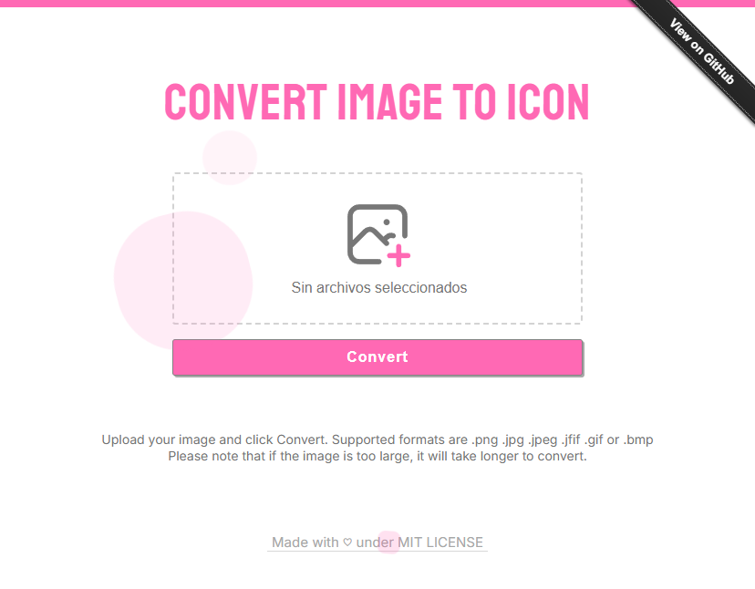

<h1 align="center">Image to Icon 🫧</h1>

Image to Icon is a web app to convert images to icon online.

 

<h2 align="left">Features</h2>

Does not cut or stretch the image. Simple interface, just a few clicks to convert. High resolution icon. 
Supports <b>.png .jpg .jpeg .jfif .gif</b> or <b>.bmp</b>

 
<h2 align="left">Info</h2>

Credits can be found on the <a href="https://genesistoxical.github.io/webapp/about.html">about</a> page.
 
<b>MIT LICENSE</b> - Copyright (c) 2023 - 2025 Génesis Toxical

